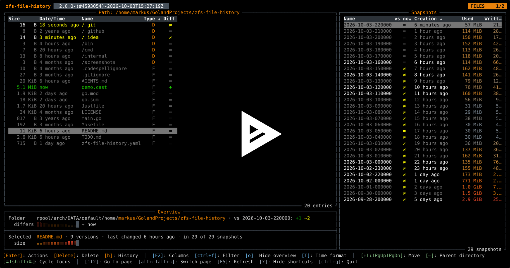

<h1 align="center">zfs-file-history</h1>
<h4 align="center">Terminal UI for inspecting and restoring file history on ZFS snapshots.</h4>

<div align="center">

[]()
[](https://github.com/markusressel/zfs-file-history/releases)
[](/LICENSE)

[](https://asciinema.org/a/1157784)

</div>

# Features

* 📁 **File browser:** Navigate datasets and snapshot contents in a terminal-based file explorer.
* ⌨️ **Keyboard-first navigation:** Use arrow keys and optional Vim key bindings for efficient traversal.
* 🔍 **Dual Diff Comparison Modes:** Inspect file changes inside the history overlay using two modes:
  * **vs Predecessor:** Chronological comparison showing how the file evolved over snapshot versions (Additions in
    Green, Deletions in Red, baseline labeled as `Initial`).
  * **vs Working Copy:** Direct comparison showing each snapshot version relative to your current local file, with
    context-aware statuses (`Present` to restore, `Absent` to remove, `Modified`, or `Identical`).
* 🩹 **Graceful Diff Fallbacks:** Diff views automatically fall back to `/dev/null` when files are missing on either
  side (e.g. deleted locally or missing in a snapshot), showing clean addition/deletion diffs instead of CLI execution
  errors.
* 🕘 **Snapshot version lookup:** Move through snapshots to locate the required file revision.
* ↕️ **Column-based sorting:** Sort table entries by any supported column in ascending or descending order.
* 🧱 **Configurable columns:** Select and order the columns of the file, snapshot and dataset tables (`F2`).
  The columns and the sort order are remembered between runs (in `~/.local/state/zfs-file-history/state.json`,
  see [State](#state)), `r` in the column dialog resets them.
* 🔎 **Filtering:** Filter files, snapshots and datasets as you type (`ctrl+f`), with glob patterns like `*.txt`.
* 🌳 **Dataset overview:** Browse all datasets as a collapsible tree or as a flat list (`t`), unmounted datasets are
  hidden by default (`u`). Both choices are remembered between runs. The used space is broken down into snapshots,
  the dataset itself, its children and its refreservation (sortable, to find the datasets whose snapshots use the
  most space).
* ♻️ **Point-in-time restore:** Restore a selected file directly from a selected snapshot. Fully supports restoring
  files that are absent in a snapshot by deleting the current working copy copy.
* 🖥️ **Responsive layout:** Dialogs and overlays automatically scale and reposition themselves during terminal resizing,
  dynamically clamping to screen bounds to prevent clipping.
* 🗂️ **Snapshot lifecycle actions:** Create, clone and destroy snapshots from within the UI.

# How to use

## Installation

### Arch Linux 

```shell
yay -S zfs-file-history-git
```

<details>
<summary>Community Maintained Packages</summary>

None yet

</details>

### Manual

Compile yourself:

```shell
git clone https://github.com/markusressel/zfs-file-history.git
cd zfs-file-history
make deploy
```

## One Time Setup

### Background Event Listening

zfs-file-history can listen to zpool events to automatically update the UI when things change in the background.
Unfortunately, due to the current design of ZFS, this requires root privileges.
To avoid having to run zfs-file-history as root, a one-time setup command can be run as root, which creates
a suders rule that lets your user run `zpool events` as root without requiring interactive permission approval.

```shell
sudo zfs-file-history setup
```

### Permissions

To create or destroy ZFS snapshots, the user running zfs-file-history needs to have the appropriate permissions, f.ex.:

```shell
sudo zfs allow markus mount,snapshot,destroy rpool/HOME/default/markus
```

otherwise zfs-file-history will show a permission error.

## Configuration

> **Note:**
> The configuration is optional. It contains display and behavior settings of the file browser,
> as well as debugging settings.

Then configure zfs-file-history by creating a YAML configuration file in **one** of the following locations:

* `/etc/zfs-file-history/zfs-file-history.yaml` (recommended)
* `/home/<user>/.config/zfs-file-history/zfs-file-history.yaml`
* `./zfs-file-history.yaml`

```shell
mkdir -P ~/.config/zfs-file-history
nano ~/.config/zfs-file-history/zfs-file-history.yaml
```

### Example

An example configuration file including more detailed documentation can be found
in [zfs-file-history.yaml](/zfs-file-history.yaml).

## State

Besides the configuration file, which is only ever written by you, zfs-file-history remembers some UI settings
(the columns and sort order of the tables, the tree view and hidden unmounted datasets of the dataset overview)
in a state file:

* `$XDG_STATE_HOME/zfs-file-history/state.json`, by default `~/.local/state/zfs-file-history/state.json`

It is written by the application and specific to the machine, so there is no need to copy it to other systems.
Deleting it resets all remembered settings.

# Dependencies

See [go.mod](go.mod)

# Similar Projects

* [zfs-snap-diff](https://github.com/j-keck/zfs-snap-diff)
* [snapshot-explorer](https://github.com/atheriel/snapshot-explorer)

# License

```
zfs-file-history
Copyright (C) 2023  Markus Ressel

This program is free software: you can redistribute it and/or modify
it under the terms of the GNU Affero General Public License as published
by the Free Software Foundation, either version 3 of the License, or
(at your option) any later version.

This program is distributed in the hope that it will be useful,
but WITHOUT ANY WARRANTY; without even the implied warranty of
MERCHANTABILITY or FITNESS FOR A PARTICULAR PURPOSE.  See the
GNU Affero General Public License for more details.

You should have received a copy of the GNU Affero General Public License
along with this program.  If not, see <https://www.gnu.org/licenses/>.
```
